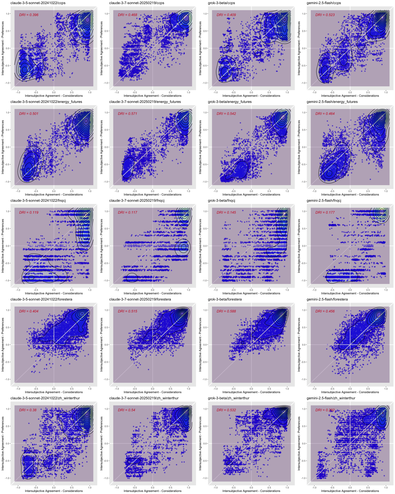

# Large-Language Models (LLMs) Preview

|     | Provider  | Model                      |
|:----|:----------|:---------------------------|
| 1   | anthropic | claude-3-5-sonnet-20241022 |
| 2   | anthropic | claude-3-7-sonnet-20250219 |
| 3   | google    | gemini-2.5-flash           |
| 4   | xai       | grok-3-beta                |

LLMs

Building on our previous analysis, we selected only top models.

# Cases

|  | case | survey | N | topic | subtopic |
|:---|:-------------------|:-----------------|---:|:-------------|:-------------|
| 1 | UBC Bio | biobanking_mayo_ubc | 17 | genomics | genomics |
| 2 | CCPS ACT Deliberative | ccps | 31 | climate | climate |
| 3 | CSIRO WA | energy_futures | 17 | climate | energy |
| 4 | FNQCJ | fnqcj | 11 | climate | transportation |
| 5 | Forest Lay Citizen | forestera | 9 | climate | forest |
| 6 | Fremantle | fremantle | 41 | transportation | transportation |
| 7 | Activate | uppsala_speaks | 26 | immigration | immigration |
| 8 | Standard | uppsala_speaks | 22 | immigration | immigration |
| 9 | Winterthur | zh_winterthur | 16 | climate | climate |

Deliberative Cases

Also building on our previous analysis, we selected only deliberative
cases.

# Surveys

|     | survey              | considerations | policies | scale_max | q_method |
|:----|:--------------------|---------------:|---------:|----------:|:---------|
| 1   | biobanking_mayo_ubc |             38 |        7 |        11 | FALSE    |
| 2   | ccps                |             33 |        7 |        11 | FALSE    |
| 3   | energy_futures      |             45 |        9 |        11 | FALSE    |
| 4   | fnqcj               |             42 |        5 |        12 | FALSE    |
| 5   | forestera           |             45 |        7 |        11 | FALSE    |
| 6   | fremantle           |             36 |        6 |        11 | TRUE     |
| 7   | uppsala_speaks      |             42 |        7 |         7 | FALSE    |
| 8   | zh_winterthur       |             30 |        6 |         7 | FALSE    |

Surveys

Note that two of the cases share the same survey.

# Roles (System Prompts)

| type        |   n |
|:------------|----:|
| devils      |   1 |
| ideology    |  10 |
| perspective |  10 |

Number of Prompts by Type

|  | uid | type | role | description |
|:-|:--|:----|:--------|:-----------------------------------------------------|
| 1 | csk | devils | climate skeptic | prioritizes economic growth over CO2 emission cuts, fossil fuels over renewable energy, and does not believe in climate science |
| 2 | ana | ideology | anarchist | rejects all coercive authority and hierarchical government, advocating stateless, voluntary societies |
| 3 | con | ideology | conservative | seeks to preserve traditional institutions, customs, and values, favoring order and gradual change |
| 4 | eco | ideology | ecologist | focuses on environmental protection and sustainability, advocating for societal change to ecological limits |
| 5 | fas | ideology | fascist | promotes extreme nationalism, authoritarianism, militarism, and a totalitarian state |
| 6 | fem | ideology | feminist | advocates for gender equality, challenging patriarchal structures and discrimination against women |
| 7 | fun | ideology | fundamentalist | adheres strictly to core beliefs, often religious, applying these principles to all life aspects |
| 8 | lib | ideology | liberal | advocates individual liberty, rights, limited government, and free markets, emphasizing individual autonomy |
| 9 | nat | ideology | nationalist | prioritizes the interests and identity of a particular nation, often seeking self-determination |
| 10 | pop | ideology | populist | appeals directly to “the people” against a perceived corrupt elite using anti-establishment rhetoric |
| 11 | soc | ideology | socialist | aims for social ownership or control of production, emphasizing equality and collective welfare |
| 12 | coa | perspective | coastal resident | endures chronic flooding and salinization, forced to relocate due to rising sea levels and intense storms worsened by climate change |
| 13 | ctr | perspective | construction worker | suffers from extreme heat stress and lost work hours, perceiving climate change making outdoor labor unbearable and life-threatening |
| 14 | dis | perspective | disease survivor | recovers from dengue fever, aware that climate change’s rising temperatures are expanding the range of disease-carrying mosquitoes in their region |
| 15 | eld | perspective | elderly urban resident | endures intensified city heatwaves, struggling with disrupted services and feeling the direct, severe impact of climate change |
| 16 | far | perspective | displaced family | loses their home due to unprecedented wildfires, experiencing displacement and recognizing climate change as the major driver of the devastation |
| 17 | fis | perspective | fisher | notes his declining catches due to warming oceans, understanding that climate change is reorganizing marine life and reducing their traditional yield |
| 18 | lan | perspective | landowner | surveys his parched fields after a prolonged drought, feeling the compounding impacts of climate change that reduce crop yields and family income |
| 19 | par | perspective | parent | sees their child fall ill from a water-borne disease, attributing its spread to the increased heavy rainfall and warmer temperatures brought by climate change |
| 20 | sub | perspective | subsistence farmer | watches his crops wither under erratic rainfall patterns, and who sees these changes as direct consequence of climate change |
| 21 | vil | perspective | villager | faces dwindling, contaminated water supplies due to extended draughts and floods, aware that climate change is altering their water security |

System Prompts

# LLM Data Collection

We collected a total of 3360 LLM responses from 4 models across 8
surveys and 21 roles. We prompted each LLM 5 times with the same prompt.

# Climate Analysis

|     | case                  | survey         |   N | topic   | subtopic       |
|:----|:----------------------|:---------------|----:|:--------|:---------------|
| 1   | CCPS ACT Deliberative | ccps           |  31 | climate | climate        |
| 2   | CSIRO WA              | energy_futures |  17 | climate | energy         |
| 3   | FNQCJ                 | fnqcj          |  11 | climate | transportation |
| 4   | Forest Lay Citizen    | forestera      |   9 | climate | forest         |
| 5   | Winterthur            | zh_winterthur  |  16 | climate | climate        |

Subset of cases used in the climate analysis

|  | uid | type | article | role | description |
|:-|:--|:----|:---|:--------|:--------------------------------------------------|
| 1 | eco | ideology | an | ecologist | focuses on environmental protection and sustainability, advocating for societal change to ecological limits |
| 2 | coa | perspective | a | coastal resident | endures chronic flooding and salinization, forced to relocate due to rising sea levels and intense storms worsened by climate change |
| 3 | ctr | perspective | a | construction worker | suffers from extreme heat stress and lost work hours, perceiving climate change making outdoor labor unbearable and life-threatening |
| 4 | dis | perspective | a | disease survivor | recovers from dengue fever, aware that climate change’s rising temperatures are expanding the range of disease-carrying mosquitoes in their region |
| 5 | eld | perspective | an | elderly urban resident | endures intensified city heatwaves, struggling with disrupted services and feeling the direct, severe impact of climate change |
| 6 | far | perspective | a | displaced family | loses their home due to unprecedented wildfires, experiencing displacement and recognizing climate change as the major driver of the devastation |
| 7 | fis | perspective | a | fisher | notes his declining catches due to warming oceans, understanding that climate change is reorganizing marine life and reducing their traditional yield |
| 8 | lan | perspective | a | landowner | surveys his parched fields after a prolonged drought, feeling the compounding impacts of climate change that reduce crop yields and family income |
| 9 | par | perspective | a | parent | sees their child fall ill from a water-borne disease, attributing its spread to the increased heavy rainfall and warmer temperatures brought by climate change |
| 10 | sub | perspective | a | subsistence farmer | watches his crops wither under erratic rainfall patterns, and who sees these changes as direct consequence of climate change |
| 11 | vil | perspective | a | villager | faces dwindling, contaminated water supplies due to extended draughts and floods, aware that climate change is altering their water security |
| 12 | csk | devils | a | climate skeptic | prioritizes economic growth over CO2 emission cuts, fossil fuels over renewable energy, and does not believe in climate science |

Subset of roles used in the climate analysis

## DRI Plots

## Summary DRI

|  | role | claude-3-5-sonnet-20241022 | claude-3-7-sonnet-20250219 | gemini-2.5-flash | grok-3-beta | best |
|:--|:---|---------------:|---------------:|----------:|-------:|:---------------|
| 1 | all | 0.360 | 0.442 | 0.382 | 0.443 | grok-3-beta |
| 2 | coa | 0.353 | 0.666 | 0.826 | 0.578 | gemini-2.5-flash |
| 3 | csk | 0.651 | 0.803 | 0.859 | 0.645 | gemini-2.5-flash |
| 4 | ctr | 0.276 | 0.406 | 0.585 | 0.434 | gemini-2.5-flash |
| 5 | dis | 0.556 | 0.527 | 0.540 | 0.467 | claude-3-5-sonnet-20241022 |
| 6 | eco | 0.305 | 0.732 | 0.861 | 0.768 | gemini-2.5-flash |
| 7 | eld | 0.439 | 0.458 | 0.690 | 0.583 | gemini-2.5-flash |
| 8 | far | 0.506 | 0.516 | 0.816 | 0.538 | gemini-2.5-flash |
| 9 | fis | 0.421 | 0.545 | 0.738 | 0.499 | gemini-2.5-flash |
| 10 | lan | 0.486 | 0.445 | 0.308 | 0.492 | grok-3-beta |
| 11 | par | 0.557 | 0.615 | 0.649 | 0.744 | grok-3-beta |
| 12 | sub | 0.612 | 0.707 | 0.390 | 0.661 | claude-3-7-sonnet-20250219 |
| 13 | vil | 0.524 | 0.552 | 0.570 | 0.626 | grok-3-beta |

Mean DRI across models and roles

## Summary Cronbach’s Alpha (Policies)

|  | role | claude-3-5-sonnet-20241022 | claude-3-7-sonnet-20250219 | gemini-2.5-flash | grok-3-beta | best |
|:--|:---|---------------:|---------------:|----------:|-------:|:---------------|
| 1 | all | 0.781 | 0.767 | 0.825 | 0.779 | gemini-2.5-flash |
| 2 | coa | 0.743 | 0.787 | 0.814 | 0.799 | gemini-2.5-flash |
| 3 | csk | 0.842 | 0.857 | 0.859 | 0.833 | gemini-2.5-flash |
| 4 | ctr | 0.758 | 0.797 | 0.897 | 0.718 | gemini-2.5-flash |
| 5 | dis | 0.749 | 0.775 | 0.801 | 0.788 | gemini-2.5-flash |
| 6 | eco | 0.746 | 0.750 | 0.866 | 0.782 | gemini-2.5-flash |
| 7 | eld | 0.733 | 0.797 | 0.800 | 0.837 | grok-3-beta |
| 8 | far | 0.745 | 0.720 | 0.849 | 0.746 | gemini-2.5-flash |
| 9 | fis | 0.744 | 0.807 | 0.853 | 0.716 | gemini-2.5-flash |
| 10 | lan | 0.683 | 0.808 | 0.817 | 0.759 | gemini-2.5-flash |
| 11 | par | 0.760 | 0.762 | 0.818 | 0.825 | grok-3-beta |
| 12 | sub | 0.869 | 0.763 | 0.837 | 0.791 | claude-3-5-sonnet-20241022 |
| 13 | vil | 0.654 | 0.824 | 0.827 | 0.724 | gemini-2.5-flash |

Mean alpha (policies) across models and roles

## Summary Cronbach’s Alpha (Consideration)

|  | role | claude-3-5-sonnet-20241022 | claude-3-7-sonnet-20250219 | gemini-2.5-flash | grok-3-beta | best |
|:--|:---|---------------:|---------------:|----------:|-------:|:---------------|
| 1 | all | 0.983 | 0.982 | 0.973 | 0.978 | claude-3-5-sonnet-20241022 |
| 2 | coa | 0.878 | 0.901 | 0.866 | 0.909 | grok-3-beta |
| 3 | csk | 0.801 | 0.874 | 0.688 | 0.867 | claude-3-7-sonnet-20250219 |
| 4 | ctr | 0.934 | 0.917 | 0.896 | 0.916 | claude-3-5-sonnet-20241022 |
| 5 | dis | 0.910 | 0.927 | 0.867 | 0.909 | claude-3-7-sonnet-20250219 |
| 6 | eco | 0.905 | 0.876 | 0.841 | 0.865 | claude-3-5-sonnet-20241022 |
| 7 | eld | 0.912 | 0.917 | 0.905 | 0.913 | claude-3-7-sonnet-20250219 |
| 8 | far | 0.910 | 0.883 | 0.840 | 0.903 | claude-3-5-sonnet-20241022 |
| 9 | fis | 0.920 | 0.912 | 0.873 | 0.924 | grok-3-beta |
| 10 | lan | 0.929 | 0.918 | 0.912 | 0.931 | grok-3-beta |
| 11 | par | 0.923 | 0.920 | 0.820 | 0.932 | grok-3-beta |
| 12 | sub | 0.903 | 0.926 | 0.862 | 0.914 | claude-3-7-sonnet-20250219 |
| 13 | vil | 0.887 | 0.911 | 0.879 | 0.910 | claude-3-7-sonnet-20250219 |

Mean alpha (considerations) across models and roles

## Detailed data

|  | model | survey | role | dri | alpha_c | alpha_p | alpha_all | n |
|:---|:--------------------|:-----------|:----|-----:|------:|------:|--------:|---:|
| 1 | claude-3-5-sonnet-20241022 | ccps | all | 0.396 | 0.986 | 0.751 | 0.985 | 105 |
| 2 | claude-3-5-sonnet-20241022 | ccps | coa | 0.437 | 0.792 | 0.590 | 0.836 | 5 |
| 3 | claude-3-5-sonnet-20241022 | ccps | csk | 0.158 | 0.768 | 0.778 | 0.746 | 5 |
| 4 | claude-3-5-sonnet-20241022 | ccps | ctr | 0.380 | 0.942 | 0.740 | 0.934 | 5 |
| 5 | claude-3-5-sonnet-20241022 | ccps | dis | 0.468 | 0.866 | 0.733 | 0.868 | 5 |
| 6 | claude-3-5-sonnet-20241022 | ccps | eco | 0.340 | 0.863 | 0.757 | 0.898 | 5 |
| 7 | claude-3-5-sonnet-20241022 | ccps | eld | 0.322 | 0.909 | 0.673 | 0.901 | 5 |
| 8 | claude-3-5-sonnet-20241022 | ccps | far | 0.434 | 0.901 | 0.632 | 0.916 | 5 |
| 9 | claude-3-5-sonnet-20241022 | ccps | fis | 0.424 | 0.941 | 0.776 | 0.928 | 5 |
| 10 | claude-3-5-sonnet-20241022 | ccps | lan | 0.457 | 0.933 | 0.689 | 0.923 | 5 |
| 11 | claude-3-5-sonnet-20241022 | ccps | par | 0.520 | 0.915 | 0.728 | 0.896 | 5 |
| 12 | claude-3-5-sonnet-20241022 | ccps | sub | -0.029 | 0.870 | 0.798 | 0.883 | 5 |
| 13 | claude-3-5-sonnet-20241022 | ccps | vil | 0.600 | 0.866 | 0.791 | 0.802 | 5 |
| 14 | claude-3-5-sonnet-20241022 | energy_futures | all | 0.501 | 0.986 | 0.858 | 0.986 | 105 |
| 15 | claude-3-5-sonnet-20241022 | energy_futures | coa | 0.167 | 0.881 | 0.771 | 0.903 | 5 |
| 16 | claude-3-5-sonnet-20241022 | energy_futures | csk | 0.869 | 0.915 | 0.726 | 0.919 | 5 |
| 17 | claude-3-5-sonnet-20241022 | energy_futures | ctr | -0.023 | 0.896 | 0.685 | 0.885 | 5 |
| 18 | claude-3-5-sonnet-20241022 | energy_futures | dis | 0.477 | 0.922 | 0.763 | 0.917 | 5 |
| 19 | claude-3-5-sonnet-20241022 | energy_futures | eco | 0.326 | 0.950 | 0.679 | 0.933 | 5 |
| 20 | claude-3-5-sonnet-20241022 | energy_futures | eld | 0.246 | 0.909 | 0.693 | 0.929 | 5 |
| 21 | claude-3-5-sonnet-20241022 | energy_futures | far | 0.553 | 0.942 | 0.767 | 0.947 | 5 |
| 22 | claude-3-5-sonnet-20241022 | energy_futures | fis | 0.436 | 0.915 | 0.786 | 0.935 | 5 |
| 23 | claude-3-5-sonnet-20241022 | energy_futures | lan | 0.645 | 0.951 | 0.658 | 0.952 | 5 |
| 24 | claude-3-5-sonnet-20241022 | energy_futures | par | 0.535 | 0.919 | 0.776 | 0.939 | 5 |
| 25 | claude-3-5-sonnet-20241022 | energy_futures | sub | 0.846 | 0.922 | 0.882 | 0.921 | 5 |
| 26 | claude-3-5-sonnet-20241022 | energy_futures | vil | 0.558 | 0.928 | 0.517 | 0.931 | 5 |
| 27 | claude-3-5-sonnet-20241022 | fnqcj | all | 0.119 | 0.982 | 0.788 | 0.982 | 105 |
| 28 | claude-3-5-sonnet-20241022 | fnqcj | coa | -0.118 | 0.858 | 0.806 | 0.878 | 5 |
| 29 | claude-3-5-sonnet-20241022 | fnqcj | csk | 0.904 | 0.802 | 1.000 | 0.794 | 5 |
| 30 | claude-3-5-sonnet-20241022 | fnqcj | ctr | -0.229 | 0.966 | 0.750 | 0.970 | 5 |
| 31 | claude-3-5-sonnet-20241022 | fnqcj | dis | 0.468 | 0.895 | 0.800 | 0.899 | 5 |
| 32 | claude-3-5-sonnet-20241022 | fnqcj | eco | 0.060 | 0.917 | 0.714 | 0.921 | 5 |
| 33 | claude-3-5-sonnet-20241022 | fnqcj | eld | 0.419 | 0.868 | 0.627 | 0.876 | 5 |
| 34 | claude-3-5-sonnet-20241022 | fnqcj | far | 0.457 | 0.875 | 0.800 | 0.911 | 5 |
| 35 | claude-3-5-sonnet-20241022 | fnqcj | fis | 0.452 | 0.933 | 0.549 | 0.936 | 5 |
| 36 | claude-3-5-sonnet-20241022 | fnqcj | lan | 0.015 | 0.979 | 0.625 | 0.980 | 5 |
| 37 | claude-3-5-sonnet-20241022 | fnqcj | par | 0.495 | 0.902 | 0.778 | 0.907 | 5 |
| 38 | claude-3-5-sonnet-20241022 | fnqcj | sub | 0.911 | 0.885 | 1.000 | 0.893 | 5 |
| 39 | claude-3-5-sonnet-20241022 | fnqcj | vil | 0.217 | 0.839 | 0.423 | 0.873 | 5 |
| 40 | claude-3-5-sonnet-20241022 | forestera | all | 0.404 | 0.979 | 0.718 | 0.979 | 105 |
| 41 | claude-3-5-sonnet-20241022 | forestera | coa | 0.832 | 0.940 | 0.768 | 0.946 | 5 |
| 42 | claude-3-5-sonnet-20241022 | forestera | csk | 0.726 | 0.895 | 0.861 | 0.908 | 5 |
| 43 | claude-3-5-sonnet-20241022 | forestera | ctr | 0.581 | 0.954 | 0.793 | 0.959 | 5 |
| 44 | claude-3-5-sonnet-20241022 | forestera | dis | 0.884 | 0.941 | 0.666 | 0.937 | 5 |
| 45 | claude-3-5-sonnet-20241022 | forestera | eco | 0.375 | 0.909 | 0.724 | 0.901 | 5 |
| 46 | claude-3-5-sonnet-20241022 | forestera | eld | 0.565 | 0.938 | 0.871 | 0.937 | 5 |
| 47 | claude-3-5-sonnet-20241022 | forestera | far | 0.637 | 0.959 | 0.747 | 0.960 | 5 |
| 48 | claude-3-5-sonnet-20241022 | forestera | fis | 0.162 | 0.920 | 0.808 | 0.931 | 5 |
| 49 | claude-3-5-sonnet-20241022 | forestera | lan | 0.629 | 0.913 | 0.646 | 0.931 | 5 |
| 50 | claude-3-5-sonnet-20241022 | forestera | par | 0.794 | 0.939 | 0.666 | 0.937 | 5 |
| 51 | claude-3-5-sonnet-20241022 | forestera | sub | 0.571 | 0.928 | 0.823 | 0.934 | 5 |
| 52 | claude-3-5-sonnet-20241022 | forestera | vil | 0.660 | 0.955 | 0.725 | 0.959 | 5 |
| 53 | claude-3-5-sonnet-20241022 | zh_winterthur | all | 0.380 | 0.983 | 0.791 | 0.983 | 105 |
| 54 | claude-3-5-sonnet-20241022 | zh_winterthur | coa | 0.447 | 0.916 | 0.778 | 0.845 | 5 |
| 55 | claude-3-5-sonnet-20241022 | zh_winterthur | csk | 0.601 | 0.623 | 0.845 | 0.820 | 5 |
| 56 | claude-3-5-sonnet-20241022 | zh_winterthur | ctr | 0.672 | 0.912 | 0.822 | 0.901 | 5 |
| 57 | claude-3-5-sonnet-20241022 | zh_winterthur | dis | 0.484 | 0.927 | 0.786 | 0.914 | 5 |
| 58 | claude-3-5-sonnet-20241022 | zh_winterthur | eco | 0.425 | 0.887 | 0.855 | 0.859 | 5 |
| 59 | claude-3-5-sonnet-20241022 | zh_winterthur | eld | 0.645 | 0.933 | 0.799 | 0.892 | 5 |
| 60 | claude-3-5-sonnet-20241022 | zh_winterthur | far | 0.449 | 0.870 | 0.778 | 0.839 | 5 |
| 61 | claude-3-5-sonnet-20241022 | zh_winterthur | fis | 0.631 | 0.893 | 0.799 | 0.900 | 5 |
| 62 | claude-3-5-sonnet-20241022 | zh_winterthur | lan | 0.683 | 0.868 | 0.799 | 0.867 | 5 |
| 63 | claude-3-5-sonnet-20241022 | zh_winterthur | par | 0.440 | 0.941 | 0.850 | 0.910 | 5 |
| 64 | claude-3-5-sonnet-20241022 | zh_winterthur | sub | 0.761 | 0.913 | 0.844 | 0.901 | 5 |
| 65 | claude-3-5-sonnet-20241022 | zh_winterthur | vil | 0.584 | 0.847 | 0.816 | 0.865 | 5 |
| 66 | claude-3-7-sonnet-20250219 | ccps | all | 0.468 | 0.984 | 0.741 | 0.983 | 105 |
| 67 | claude-3-7-sonnet-20250219 | ccps | coa | 0.683 | 0.874 | 0.717 | 0.908 | 5 |
| 68 | claude-3-7-sonnet-20250219 | ccps | csk | 0.719 | 0.813 | 0.855 | 0.863 | 5 |
| 69 | claude-3-7-sonnet-20250219 | ccps | ctr | 0.769 | 0.951 | 0.682 | 0.944 | 5 |
| 70 | claude-3-7-sonnet-20250219 | ccps | dis | 0.544 | 0.927 | 0.732 | 0.916 | 5 |
| 71 | claude-3-7-sonnet-20250219 | ccps | eco | 0.867 | 0.862 | 0.887 | 0.873 | 5 |
| 72 | claude-3-7-sonnet-20250219 | ccps | eld | 0.576 | 0.890 | 0.732 | 0.899 | 5 |
| 73 | claude-3-7-sonnet-20250219 | ccps | far | 0.785 | 0.759 | 0.682 | 0.853 | 5 |
| 74 | claude-3-7-sonnet-20250219 | ccps | fis | 0.582 | 0.899 | 0.819 | 0.888 | 5 |
| 75 | claude-3-7-sonnet-20250219 | ccps | lan | 0.523 | 0.917 | 0.764 | 0.902 | 5 |
| 76 | claude-3-7-sonnet-20250219 | ccps | par | 0.770 | 0.902 | 0.682 | 0.921 | 5 |
| 77 | claude-3-7-sonnet-20250219 | ccps | sub | 0.780 | 0.920 | 0.682 | 0.923 | 5 |
| 78 | claude-3-7-sonnet-20250219 | ccps | vil | 0.585 | 0.817 | 0.798 | 0.872 | 5 |
| 79 | claude-3-7-sonnet-20250219 | energy_futures | all | 0.571 | 0.985 | 0.885 | 0.986 | 105 |
| 80 | claude-3-7-sonnet-20250219 | energy_futures | coa | 0.560 | 0.935 | 0.741 | 0.941 | 5 |
| 81 | claude-3-7-sonnet-20250219 | energy_futures | csk | 0.801 | 0.915 | 0.833 | 0.947 | 5 |
| 82 | claude-3-7-sonnet-20250219 | energy_futures | ctr | 0.420 | 0.902 | 0.842 | 0.929 | 5 |
| 83 | claude-3-7-sonnet-20250219 | energy_futures | dis | 0.568 | 0.911 | 0.689 | 0.901 | 5 |
| 84 | claude-3-7-sonnet-20250219 | energy_futures | eco | 0.774 | 0.859 | 0.706 | 0.901 | 5 |
| 85 | claude-3-7-sonnet-20250219 | energy_futures | eld | 0.288 | 0.930 | 0.789 | 0.942 | 5 |
| 86 | claude-3-7-sonnet-20250219 | energy_futures | far | 0.663 | 0.917 | 0.889 | 0.928 | 5 |
| 87 | claude-3-7-sonnet-20250219 | energy_futures | fis | 0.563 | 0.935 | 0.758 | 0.942 | 5 |
| 88 | claude-3-7-sonnet-20250219 | energy_futures | lan | 0.546 | 0.863 | 0.797 | 0.893 | 5 |
| 89 | claude-3-7-sonnet-20250219 | energy_futures | par | 0.813 | 0.924 | 0.598 | 0.921 | 5 |
| 90 | claude-3-7-sonnet-20250219 | energy_futures | sub | 0.791 | 0.936 | 0.849 | 0.949 | 5 |
| 91 | claude-3-7-sonnet-20250219 | energy_futures | vil | 0.622 | 0.910 | 0.798 | 0.924 | 5 |
| 92 | claude-3-7-sonnet-20250219 | fnqcj | all | 0.117 | 0.980 | 0.671 | 0.980 | 105 |
| 93 | claude-3-7-sonnet-20250219 | fnqcj | coa | 0.822 | 0.838 | 0.857 | 0.843 | 5 |
| 94 | claude-3-7-sonnet-20250219 | fnqcj | csk | 0.904 | 0.904 | 1.000 | 0.907 | 5 |
| 95 | claude-3-7-sonnet-20250219 | fnqcj | ctr | -0.222 | 0.914 | 0.801 | 0.914 | 5 |
| 96 | claude-3-7-sonnet-20250219 | fnqcj | dis | 0.172 | 0.927 | 0.859 | 0.925 | 5 |
| 97 | claude-3-7-sonnet-20250219 | fnqcj | eco | 0.612 | 0.870 | 0.469 | 0.886 | 5 |
| 98 | claude-3-7-sonnet-20250219 | fnqcj | eld | 0.030 | 0.968 | 0.742 | 0.966 | 5 |
| 99 | claude-3-7-sonnet-20250219 | fnqcj | far | -0.235 | 0.940 | 0.820 | 0.939 | 5 |
| 100 | claude-3-7-sonnet-20250219 | fnqcj | fis | 0.149 | 0.917 | 0.820 | 0.916 | 5 |
| 101 | claude-3-7-sonnet-20250219 | fnqcj | lan | 0.092 | 0.908 | 0.812 | 0.921 | 5 |
| 102 | claude-3-7-sonnet-20250219 | fnqcj | par | 0.188 | 0.940 | 0.859 | 0.928 | 5 |
| 103 | claude-3-7-sonnet-20250219 | fnqcj | sub | 0.704 | 0.937 | 0.656 | 0.934 | 5 |
| 104 | claude-3-7-sonnet-20250219 | fnqcj | vil | 0.146 | 0.956 | 0.859 | 0.961 | 5 |
| 105 | claude-3-7-sonnet-20250219 | forestera | all | 0.515 | 0.982 | 0.787 | 0.982 | 105 |
| 106 | claude-3-7-sonnet-20250219 | forestera | coa | 0.813 | 0.913 | 0.840 | 0.933 | 5 |
| 107 | claude-3-7-sonnet-20250219 | forestera | csk | 0.790 | 0.899 | 0.880 | 0.903 | 5 |
| 108 | claude-3-7-sonnet-20250219 | forestera | ctr | 0.553 | 0.944 | 0.812 | 0.950 | 5 |
| 109 | claude-3-7-sonnet-20250219 | forestera | dis | 0.848 | 0.947 | 0.699 | 0.949 | 5 |
| 110 | claude-3-7-sonnet-20250219 | forestera | eco | 0.887 | 0.932 | 0.750 | 0.934 | 5 |
| 111 | claude-3-7-sonnet-20250219 | forestera | eld | 0.763 | 0.923 | 0.865 | 0.940 | 5 |
| 112 | claude-3-7-sonnet-20250219 | forestera | far | 0.860 | 0.933 | 0.361 | 0.934 | 5 |
| 113 | claude-3-7-sonnet-20250219 | forestera | fis | 0.801 | 0.959 | 0.837 | 0.965 | 5 |
| 114 | claude-3-7-sonnet-20250219 | forestera | lan | 0.235 | 0.940 | 0.850 | 0.948 | 5 |
| 115 | claude-3-7-sonnet-20250219 | forestera | par | 0.764 | 0.945 | 0.840 | 0.943 | 5 |
| 116 | claude-3-7-sonnet-20250219 | forestera | sub | 0.695 | 0.934 | 0.760 | 0.943 | 5 |
| 117 | claude-3-7-sonnet-20250219 | forestera | vil | 0.803 | 0.960 | 0.805 | 0.957 | 5 |
| 118 | claude-3-7-sonnet-20250219 | zh_winterthur | all | 0.540 | 0.981 | 0.752 | 0.981 | 105 |
| 119 | claude-3-7-sonnet-20250219 | zh_winterthur | coa | 0.452 | 0.945 | 0.778 | 0.916 | 5 |
| 120 | claude-3-7-sonnet-20250219 | zh_winterthur | csk | 0.797 | 0.839 | 0.718 | 0.841 | 5 |
| 121 | claude-3-7-sonnet-20250219 | zh_winterthur | ctr | 0.512 | 0.874 | 0.848 | 0.894 | 5 |
| 122 | claude-3-7-sonnet-20250219 | zh_winterthur | dis | 0.504 | 0.924 | 0.894 | 0.880 | 5 |
| 123 | claude-3-7-sonnet-20250219 | zh_winterthur | eco | 0.517 | 0.860 | 0.939 | 0.877 | 5 |
| 124 | claude-3-7-sonnet-20250219 | zh_winterthur | eld | 0.630 | 0.875 | 0.857 | 0.854 | 5 |
| 125 | claude-3-7-sonnet-20250219 | zh_winterthur | far | 0.506 | 0.866 | 0.848 | 0.884 | 5 |
| 126 | claude-3-7-sonnet-20250219 | zh_winterthur | fis | 0.633 | 0.851 | 0.800 | 0.910 | 5 |
| 127 | claude-3-7-sonnet-20250219 | zh_winterthur | lan | 0.830 | 0.961 | 0.816 | 0.964 | 5 |
| 128 | claude-3-7-sonnet-20250219 | zh_winterthur | par | 0.543 | 0.888 | 0.833 | 0.812 | 5 |
| 129 | claude-3-7-sonnet-20250219 | zh_winterthur | sub | 0.564 | 0.902 | 0.870 | 0.929 | 5 |
| 130 | claude-3-7-sonnet-20250219 | zh_winterthur | vil | 0.606 | 0.912 | 0.857 | 0.914 | 5 |
| 131 | gemini-2.5-flash | ccps | all | 0.523 | 0.974 | 0.798 | 0.975 | 105 |
| 132 | gemini-2.5-flash | ccps | coa | 0.854 | 0.750 | 0.889 | 0.805 | 5 |
| 133 | gemini-2.5-flash | ccps | csk | 0.895 | 0.606 | 0.722 | 0.718 | 5 |
| 134 | gemini-2.5-flash | ccps | ctr | 0.784 | 0.782 | 0.948 | 0.839 | 5 |
| 135 | gemini-2.5-flash | ccps | dis | 0.942 | 0.880 | 0.831 | 0.889 | 5 |
| 136 | gemini-2.5-flash | ccps | eco | 0.826 | 0.841 | 0.940 | 0.872 | 5 |
| 137 | gemini-2.5-flash | ccps | eld | 0.848 | 0.848 | 0.647 | 0.876 | 5 |
| 138 | gemini-2.5-flash | ccps | far | 0.937 | 0.702 | 0.750 | 0.694 | 5 |
| 139 | gemini-2.5-flash | ccps | fis | 0.899 | 0.874 | 0.750 | 0.882 | 5 |
| 140 | gemini-2.5-flash | ccps | lan | 0.688 | 0.833 | 0.781 | 0.844 | 5 |
| 141 | gemini-2.5-flash | ccps | par | 0.703 | 0.869 | 0.706 | 0.883 | 5 |
| 142 | gemini-2.5-flash | ccps | sub | 0.875 | 0.861 | 0.844 | 0.891 | 5 |
| 143 | gemini-2.5-flash | ccps | vil | 0.753 | 0.882 | 0.725 | 0.912 | 5 |
| 144 | gemini-2.5-flash | energy_futures | all | 0.464 | 0.980 | 0.859 | 0.982 | 105 |
| 145 | gemini-2.5-flash | energy_futures | coa | 0.906 | 0.928 | 0.625 | 0.941 | 5 |
| 146 | gemini-2.5-flash | energy_futures | csk | 0.809 | 0.859 | 0.907 | 0.902 | 5 |
| 147 | gemini-2.5-flash | energy_futures | ctr | 0.620 | 0.893 | 0.857 | 0.915 | 5 |
| 148 | gemini-2.5-flash | energy_futures | dis | 0.313 | 0.895 | 0.681 | 0.907 | 5 |
| 149 | gemini-2.5-flash | energy_futures | eco | 0.853 | 0.866 | 0.753 | 0.893 | 5 |
| 150 | gemini-2.5-flash | energy_futures | eld | 0.771 | 0.939 | 0.871 | 0.954 | 5 |
| 151 | gemini-2.5-flash | energy_futures | far | 0.827 | 0.870 | 0.821 | 0.901 | 5 |
| 152 | gemini-2.5-flash | energy_futures | fis | 0.486 | 0.930 | 0.884 | 0.923 | 5 |
| 153 | gemini-2.5-flash | energy_futures | lan | 0.138 | 0.934 | 0.759 | 0.944 | 5 |
| 154 | gemini-2.5-flash | energy_futures | par | 0.220 | 0.900 | 0.823 | 0.910 | 5 |
| 155 | gemini-2.5-flash | energy_futures | sub | 0.375 | 0.850 | 0.733 | 0.893 | 5 |
| 156 | gemini-2.5-flash | energy_futures | vil | -0.119 | 0.910 | 0.892 | 0.932 | 5 |
| 157 | gemini-2.5-flash | fnqcj | all | 0.177 | 0.974 | 0.880 | 0.975 | 105 |
| 158 | gemini-2.5-flash | fnqcj | coa | 0.846 | 0.822 | 1.000 | 0.822 | 5 |
| 159 | gemini-2.5-flash | fnqcj | csk | 0.743 | 0.896 | 1.000 | 0.896 | 5 |
| 160 | gemini-2.5-flash | fnqcj | ctr | 0.190 | 0.979 | 0.920 | 0.980 | 5 |
| 161 | gemini-2.5-flash | fnqcj | dis | 0.242 | 0.839 | 1.000 | 0.846 | 5 |
| 162 | gemini-2.5-flash | fnqcj | eco | 0.860 | 0.806 | 1.000 | 0.814 | 5 |
| 163 | gemini-2.5-flash | fnqcj | eld | 0.868 | 0.819 | 1.000 | 0.821 | 5 |
| 164 | gemini-2.5-flash | fnqcj | far | 0.832 | 0.806 | 1.000 | 0.806 | 5 |
| 165 | gemini-2.5-flash | fnqcj | fis | 0.913 | 0.721 | 1.000 | 0.721 | 5 |
| 166 | gemini-2.5-flash | fnqcj | lan | 0.053 | 0.967 | 0.910 | 0.971 | 5 |
| 167 | gemini-2.5-flash | fnqcj | par | 0.906 | 0.649 | 1.000 | 0.649 | 5 |
| 168 | gemini-2.5-flash | fnqcj | sub | -0.492 | 0.838 | 0.981 | 0.860 | 5 |
| 169 | gemini-2.5-flash | fnqcj | vil | 0.839 | 0.880 | 1.000 | 0.880 | 5 |
| 170 | gemini-2.5-flash | forestera | all | 0.456 | 0.966 | 0.809 | 0.969 | 105 |
| 171 | gemini-2.5-flash | forestera | coa | 0.852 | 0.960 | 0.757 | 0.963 | 5 |
| 172 | gemini-2.5-flash | forestera | csk | 0.928 | 0.891 | 0.750 | 0.891 | 5 |
| 173 | gemini-2.5-flash | forestera | ctr | 0.748 | 0.949 | 0.810 | 0.946 | 5 |
| 174 | gemini-2.5-flash | forestera | dis | 0.754 | 0.919 | 0.692 | 0.924 | 5 |
| 175 | gemini-2.5-flash | forestera | eco | 0.882 | 0.871 | 0.886 | 0.888 | 5 |
| 176 | gemini-2.5-flash | forestera | eld | 0.194 | 0.958 | 0.776 | 0.958 | 5 |
| 177 | gemini-2.5-flash | forestera | far | 0.786 | 0.951 | 0.764 | 0.955 | 5 |
| 178 | gemini-2.5-flash | forestera | fis | 0.720 | 0.957 | 0.778 | 0.959 | 5 |
| 179 | gemini-2.5-flash | forestera | lan | 0.055 | 0.938 | 0.807 | 0.944 | 5 |
| 180 | gemini-2.5-flash | forestera | par | 0.542 | 0.959 | 0.722 | 0.960 | 5 |
| 181 | gemini-2.5-flash | forestera | sub | 0.772 | 0.920 | 0.922 | 0.929 | 5 |
| 182 | gemini-2.5-flash | forestera | vil | 0.787 | 0.899 | 0.712 | 0.917 | 5 |
| 183 | gemini-2.5-flash | zh_winterthur | all | 0.292 | 0.972 | 0.777 | 0.971 | 105 |
| 184 | gemini-2.5-flash | zh_winterthur | coa | 0.671 | 0.868 | 0.800 | 0.868 | 5 |
| 185 | gemini-2.5-flash | zh_winterthur | csk | 0.922 | 0.189 | 0.917 | 0.830 | 5 |
| 186 | gemini-2.5-flash | zh_winterthur | ctr | 0.586 | 0.880 | 0.949 | 0.912 | 5 |
| 187 | gemini-2.5-flash | zh_winterthur | dis | 0.451 | 0.803 | 0.800 | 0.885 | 5 |
| 188 | gemini-2.5-flash | zh_winterthur | eco | 0.882 | 0.819 | 0.750 | 0.843 | 5 |
| 189 | gemini-2.5-flash | zh_winterthur | eld | 0.769 | 0.962 | 0.704 | 0.961 | 5 |
| 190 | gemini-2.5-flash | zh_winterthur | far | 0.700 | 0.871 | 0.909 | 0.906 | 5 |
| 191 | gemini-2.5-flash | zh_winterthur | fis | 0.671 | 0.885 | 0.853 | 0.925 | 5 |
| 192 | gemini-2.5-flash | zh_winterthur | lan | 0.605 | 0.886 | 0.825 | 0.931 | 5 |
| 193 | gemini-2.5-flash | zh_winterthur | par | 0.872 | 0.722 | 0.840 | 0.851 | 5 |
| 194 | gemini-2.5-flash | zh_winterthur | sub | 0.419 | 0.843 | 0.705 | 0.843 | 5 |
| 195 | gemini-2.5-flash | zh_winterthur | vil | 0.588 | 0.825 | 0.806 | 0.863 | 5 |
| 196 | grok-3-beta | ccps | all | 0.409 | 0.981 | 0.739 | 0.981 | 105 |
| 197 | grok-3-beta | ccps | coa | 0.245 | 0.862 | 0.856 | 0.910 | 5 |
| 198 | grok-3-beta | ccps | csk | 0.786 | 0.900 | 0.917 | 0.921 | 5 |
| 199 | grok-3-beta | ccps | ctr | 0.223 | 0.924 | 0.870 | 0.940 | 5 |
| 200 | grok-3-beta | ccps | dis | 0.237 | 0.909 | 0.882 | 0.923 | 5 |
| 201 | grok-3-beta | ccps | eco | 0.666 | 0.877 | 0.855 | 0.859 | 5 |
| 202 | grok-3-beta | ccps | eld | 0.304 | 0.885 | 0.828 | 0.883 | 5 |
| 203 | grok-3-beta | ccps | far | 0.224 | 0.872 | 0.882 | 0.919 | 5 |
| 204 | grok-3-beta | ccps | fis | 0.325 | 0.885 | 0.837 | 0.926 | 5 |
| 205 | grok-3-beta | ccps | lan | 0.384 | 0.923 | 0.815 | 0.916 | 5 |
| 206 | grok-3-beta | ccps | par | 0.232 | 0.899 | 0.882 | 0.923 | 5 |
| 207 | grok-3-beta | ccps | sub | 0.378 | 0.918 | 0.853 | 0.937 | 5 |
| 208 | grok-3-beta | ccps | vil | 0.323 | 0.921 | 0.837 | 0.912 | 5 |
| 209 | grok-3-beta | energy_futures | all | 0.542 | 0.980 | 0.907 | 0.983 | 105 |
| 210 | grok-3-beta | energy_futures | coa | 0.878 | 0.885 | 0.760 | 0.912 | 5 |
| 211 | grok-3-beta | energy_futures | csk | 0.797 | 0.856 | 0.908 | 0.900 | 5 |
| 212 | grok-3-beta | energy_futures | ctr | 0.278 | 0.908 | 0.673 | 0.922 | 5 |
| 213 | grok-3-beta | energy_futures | dis | 0.514 | 0.949 | 0.773 | 0.923 | 5 |
| 214 | grok-3-beta | energy_futures | eco | 0.954 | 0.919 | 0.529 | 0.919 | 5 |
| 215 | grok-3-beta | energy_futures | eld | 0.805 | 0.908 | 0.821 | 0.902 | 5 |
| 216 | grok-3-beta | energy_futures | far | 0.515 | 0.935 | 0.754 | 0.917 | 5 |
| 217 | grok-3-beta | energy_futures | fis | 0.834 | 0.921 | 0.708 | 0.928 | 5 |
| 218 | grok-3-beta | energy_futures | lan | 0.552 | 0.927 | 0.692 | 0.926 | 5 |
| 219 | grok-3-beta | energy_futures | par | 0.901 | 0.937 | 0.836 | 0.942 | 5 |
| 220 | grok-3-beta | energy_futures | sub | 0.857 | 0.910 | 0.782 | 0.930 | 5 |
| 221 | grok-3-beta | energy_futures | vil | 0.640 | 0.907 | 0.367 | 0.918 | 5 |
| 222 | grok-3-beta | fnqcj | all | 0.145 | 0.976 | 0.621 | 0.977 | 105 |
| 223 | grok-3-beta | fnqcj | coa | 0.315 | 0.922 | 0.852 | 0.928 | 5 |
| 224 | grok-3-beta | fnqcj | csk | 0.000 | 0.927 | 0.854 | 0.938 | 5 |
| 225 | grok-3-beta | fnqcj | ctr | 0.087 | 0.913 | 0.693 | 0.927 | 5 |
| 226 | grok-3-beta | fnqcj | dis | 0.157 | 0.923 | 0.771 | 0.930 | 5 |
| 227 | grok-3-beta | fnqcj | eco | 0.889 | 0.865 | 1.000 | 0.869 | 5 |
| 228 | grok-3-beta | fnqcj | eld | 0.357 | 0.925 | 0.852 | 0.931 | 5 |
| 229 | grok-3-beta | fnqcj | far | 0.568 | 0.846 | 0.583 | 0.877 | 5 |
| 230 | grok-3-beta | fnqcj | fis | -0.018 | 0.947 | 0.703 | 0.942 | 5 |
| 231 | grok-3-beta | fnqcj | lan | 0.029 | 0.956 | 0.703 | 0.949 | 5 |
| 232 | grok-3-beta | fnqcj | par | 0.886 | 0.932 | 0.825 | 0.936 | 5 |
| 233 | grok-3-beta | fnqcj | sub | 0.607 | 0.881 | 0.583 | 0.904 | 5 |
| 234 | grok-3-beta | fnqcj | vil | 0.474 | 0.959 | 0.867 | 0.963 | 5 |
| 235 | grok-3-beta | forestera | all | 0.588 | 0.974 | 0.824 | 0.976 | 105 |
| 236 | grok-3-beta | forestera | coa | 0.874 | 0.952 | 0.720 | 0.957 | 5 |
| 237 | grok-3-beta | forestera | csk | 0.841 | 0.913 | 0.757 | 0.914 | 5 |
| 238 | grok-3-beta | forestera | ctr | 0.743 | 0.952 | 0.632 | 0.948 | 5 |
| 239 | grok-3-beta | forestera | dis | 0.814 | 0.932 | 0.781 | 0.938 | 5 |
| 240 | grok-3-beta | forestera | eco | 0.865 | 0.869 | 0.764 | 0.909 | 5 |
| 241 | grok-3-beta | forestera | eld | 0.680 | 0.931 | 0.849 | 0.934 | 5 |
| 242 | grok-3-beta | forestera | far | 0.628 | 0.956 | 0.676 | 0.960 | 5 |
| 243 | grok-3-beta | forestera | fis | 0.706 | 0.959 | 0.766 | 0.958 | 5 |
| 244 | grok-3-beta | forestera | lan | 0.669 | 0.950 | 0.719 | 0.953 | 5 |
| 245 | grok-3-beta | forestera | par | 0.825 | 0.964 | 0.801 | 0.961 | 5 |
| 246 | grok-3-beta | forestera | sub | 0.736 | 0.957 | 0.855 | 0.965 | 5 |
| 247 | grok-3-beta | forestera | vil | 0.814 | 0.927 | 0.770 | 0.929 | 5 |
| 248 | grok-3-beta | zh_winterthur | all | 0.532 | 0.976 | 0.804 | 0.977 | 105 |
| 249 | grok-3-beta | zh_winterthur | coa | 0.580 | 0.926 | 0.806 | 0.896 | 5 |
| 250 | grok-3-beta | zh_winterthur | csk | 0.801 | 0.738 | 0.729 | 0.835 | 5 |
| 251 | grok-3-beta | zh_winterthur | ctr | 0.840 | 0.885 | 0.721 | 0.894 | 5 |
| 252 | grok-3-beta | zh_winterthur | dis | 0.614 | 0.831 | 0.733 | 0.883 | 5 |
| 253 | grok-3-beta | zh_winterthur | eco | 0.467 | 0.793 | 0.763 | 0.857 | 5 |
| 254 | grok-3-beta | zh_winterthur | eld | 0.771 | 0.914 | 0.835 | 0.917 | 5 |
| 255 | grok-3-beta | zh_winterthur | far | 0.752 | 0.907 | 0.835 | 0.899 | 5 |
| 256 | grok-3-beta | zh_winterthur | fis | 0.647 | 0.908 | 0.567 | 0.925 | 5 |
| 257 | grok-3-beta | zh_winterthur | lan | 0.825 | 0.901 | 0.868 | 0.907 | 5 |
| 258 | grok-3-beta | zh_winterthur | par | 0.877 | 0.929 | 0.781 | 0.941 | 5 |
| 259 | grok-3-beta | zh_winterthur | sub | 0.726 | 0.904 | 0.881 | 0.920 | 5 |
| 260 | grok-3-beta | zh_winterthur | vil | 0.878 | 0.833 | 0.781 | 0.910 | 5 |

DRI consistency cross 12 climate roles

# References
